Git基本操作

[TOC]

# 1. Git 介绍

`Git`是一个开源的分布式版本控制系统，可以有效、高速地处理从很小到非常大的项目版本管理。

## 1.1`Git`的优势

-  速度快

-  设计简单

-  对非线性开发模式的强力支持

-  完全分布式

-  有能力高效管理类似 Linux 内核一样的超大规模项目

## 1.2 `Git`常见操作

- Clone：克隆，就是将远程仓库复制到本地
- Push：推送，就是将本地仓库代码上传到远程仓库
- Pull：拉取，就是将远程仓库代码下载到本地仓库
- commit：提交，将工作区代码提交到本地仓库

## 1.3 `Git` 操作流程

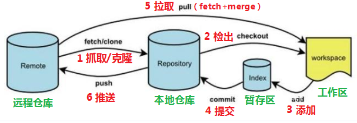

- 基本介绍
  - 远程仓库：在局域网或互联网上的一个主机，存放代码库的主机或平台
  - 本地仓库：本机上的包含`.git`文件夹的父文件夹（每个仓库下都有`.git`文件夹）,`.git`目录下存储了好多配置信息、日志信息、版本信息、工作区、暂存区信息等
  - 暂存区：`.git`目录下的`index`文件就是暂存区。只要暂存区的文件才能提交到本地仓库
  - 工作区：对本仓库下的文件的修改，都会放到工作区，只有add之后才会进入暂存区
  - 分支：一般仓库默认分支是主分支(master),可以在主分支创建很多子分支，比如开发分支develop、修复分支bugfix等
- 基本操作
  - clone：把远程仓库克隆到本地
  - fetch：也是克隆操作，但是不合并
  - checkout：从本地检出一个分支，然后修订
  - add：添加工作区文件到暂存区
  - commit：将暂存区文件提交到本地仓库
  - pull：从远程仓库拉取本地库，并自动合并。然后放到工作区
  - push：将本地仓库推送到远程仓库

## 1.4 工作目录下文件状态

- untracked：未跟踪（未纳入版本控制）
- tracked：已跟踪（已纳入版本控制）
- unmodified：未修改状态
- modified：已修改状态
- staged：已暂存状态

# 2 `Git`常用命令

## 2.1 `git`软件安装

先安装git的软件，然后右键打开Git Bash

## 2.2 设置用户信息

输入如下命令设置用户名

```bash
 git config --global user.name "用户名"
```

输入如下命令设置电子邮件

```bash
git config --global user.email "xxx@example.com"
```

输入以下信息记住用户名和密码

```bash
git config --global credential.helper store
```

然后可以输入以下命令查看配置信息

```bash
git config --list
```

```bash
git config user.name
```

## 2.3 操作本地仓库

### 2.3.1 在本地创建一个文件夹

```bash
mkdir test
```


### 2.3.2  初始化这个文件夹为仓库

先进入文件夹

```bash
cd test
```

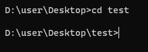

再初始化仓库

```bash
git init
```

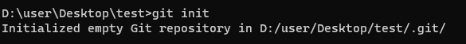

### 2.3.3 查看本地仓库的状态

再查看状态

```bash
git status [-s]
```

带参数s则显示简洁信息

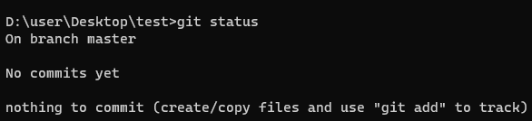

我们创建一个文件，输入一些内容（图标上问号代表这个文件是未纳入版本控制，需要装插件）

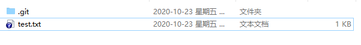

此时我们查看状态

```bash
git status
```

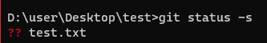

test.txt是新增文件

### 2.3.4 将新增文件添加到暂存区

命令：

- `git add 单个文件名`添加单个文件
- `git add 通配符` 添加多个文件
- `git add .`添加全部文件

```bash
git add test.txt
```

然后查看状态

```bash
git status -s
```


文件已被加入暂存区

###  2.3.5 将暂存区的文件取消纳入版本控制

命令 ：git reset 文件名

```bash
git reset test.txt
```

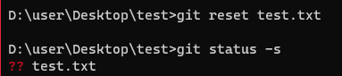

### 2.3.6 提交暂存区文件到本地仓库

命令：git commit -m '注释内容'

```bash
git commit -m '首次提交'
```

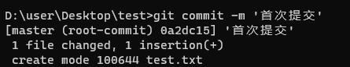

### 2.3.7 查看日志

命令：git log

```bash
git log
```

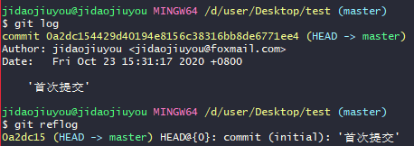

### 2.3.8 配置忽略列表

我们可以创建`.gitignore`文件来配置git不再管理的文件


## 2.4 操作远程仓库

### 2.4.1 关联本地仓库和远程仓库

在本地仓库目录下输入命令

命令：git remote add <远端名称> <仓库路径>

```bash
git remote add gitee https://gitee.com/jidaojiuyou/study.git
```

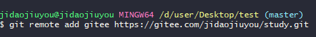

### 2.4.2 查看远程仓库

命令：git remote

```bash
git remote
```

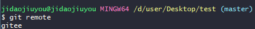

查看具体的远程路径

```bash
git remote show gitee
```

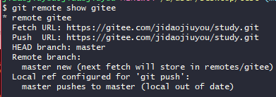

### 2.4.3 推送本地仓库到远程仓库

命令： git push <远程名称> <本地名称>

```bash
git push gitee master
```

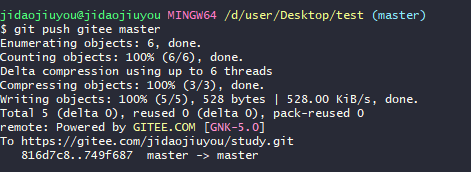

### 2.4.4 从远程克隆

命令：git clone <远程仓库地址>

```bash
git clone https://gitee.com/jidaojiuyou/study.git
```

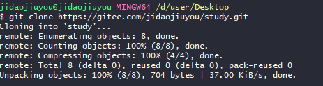

### 2.4.5 从远程仓库抓取/拉取

命令：git fetch <远程仓库名> <本地分支名称>

```bash
git fetch gitee master
```

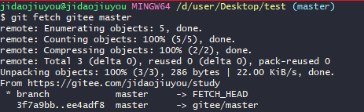

**合并分支**

命令：git merge <远程仓库名> <本地分支名称>

```bash
git merge gitee/master
```

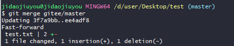

一般是直接使用拉取。

**拉取**

命令：git pull <远程仓库名> <本地分支名称>

```bash
git pull gitee master
```

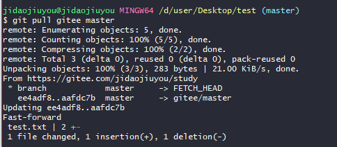

会自动合并文件。


---

### 2.4.6 合并冲突

多人协作开发避免不了同时修改同一文件的相同位置。此时拉取文件就会出现合并冲突。

此时文件就会标记冲突，由开发人员解决冲突后重新提交。（add commit push）

## 2.5 分支

TODO TODO

### 2.5.1 查看分支

TODO

### 2.5.2 创建分支

TODO

### 2.5.3 切换分支

TODO

### 2.5.4 将分支推送到远程仓库

TODO

### 2.5.5 合并分支

TODO

### 2.5.6 删除分支

TODO

