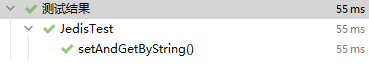
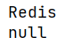
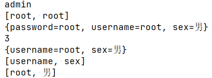
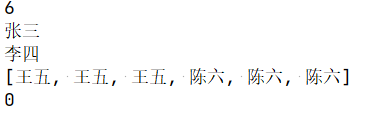
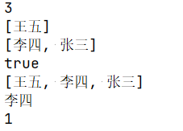

# Java 操作 Redis

[TOC]

Redis不仅可以使用命令来操作，还可以用主流的语言操作，比如java、C、C#、C++、php、Node.js、Go等。 在官方网站里有一些Java的客户端，如Jedis、luttuce、Redisson、Jredis、JDBC-Redis等。其中官方推荐使用Jedis和Redisson。 在企业中用的最多的就是Jedis。

## 1 不使用连接池，直接存取String

```java
package com.jidaojiuyou;

import org.junit.jupiter.api.Assertions;
import org.junit.jupiter.api.Test;
import redis.clients.jedis.Jedis;

/**
 * @author jidaojiuyou
 * @version 1.0
 * Jedis测试
 */
public class JedisTest {
    private static final int PORT = 6379;
    private static final String IP = "127.0.0.1";

    /**
     * 测试Redis String类型值的set、get和del方法
     */
    @Test
    void setAndGetByString(){
        // 创建jedis对象
        Jedis jedis = new Jedis(IP, PORT);
        // 设置键值对
        jedis.set("Hello","World");
        // 断言,以键取值，值与预期相同
        Assertions.assertEquals(jedis.get("Hello"),"World");
        // 删除键
        jedis.del("Hello");
        // 断言,以键取值，值为null
        Assertions.assertNull(jedis.get("Hello"));
        // 关闭资源
        jedis.close();
    }
}
```

测试结果：



测试通过

表示，对应的方法取到了确切的值

## 2 使用连接池

### 2.1 书写工具类

```java
package com.jidaojiuyou.util;

import redis.clients.jedis.Jedis;
import redis.clients.jedis.JedisPool;
import redis.clients.jedis.JedisPoolConfig;

/**
 * @author jidaojiuyou
 * @version 1.0
 * Redis工具类
 */
public class RedisUtils {
    /**
     * Ip
     */
    private static final String IP = "127.0.0.1";
    /**
     * 端口
     */
    private static final int PORT = 6379;
    /**
     * 连接池
     */
    private static final JedisPool JEDISPOOL;


    static {
        JedisPoolConfig jedisPoolConfig = new JedisPoolConfig();
        JEDISPOOL = new JedisPool(jedisPoolConfig, IP, PORT);
    }

    /**
     * @author jidaojiuyou
     * @return redis.clients.jedis.Jedis 连接池<br />
     * 获取连接池对象
     */
    public static Jedis getResource(){
        return JEDISPOOL.getResource();
    }


    /**
     * @author jidaojiuyou
     * @date 2020-11-03
     * 关闭连接池
     */
    public static void close(Jedis jedis){
        if (jedis != null) {
            jedis.close();
        }
    }
}
```

### 2.2 测试String类型

```java
    @Test
    void StringTest(){
        Jedis jedis = RedisUtils.getResource();
        // set
        jedis.set("Hello","Redis");

        // get
        String hello = jedis.get("Hello");
        System.out.println(hello);

        //del
        jedis.del("Hello");
        System.out.println(jedis.get("hello"));

        RedisUtils.close(jedis);
    }
```




### 2.3 测试Hash类型

```java
    @Test
    void HashTest(){
        Jedis jedis = RedisUtils.getResource();

        // hset hget
        jedis.hset("user", "username", "admin");
        System.out.println(jedis.hget("user", "username"));

        HashMap<String, String> user1 = new HashMap<>();
        user1.put("username","root");
        user1.put("password","root");
        user1.put("sex","男");

        // hmset hmget
        jedis.hmset("user1",user1);
        List<String> hmget = jedis.hmget("user1", "username", "password");
        System.out.println(hmget);

        // hgetAll
        Map<String, String> all = jedis.hgetAll("user1");
        System.out.println(all);

        // hlen
        Long len = jedis.hlen("user1");
        System.out.println(len);

        // hdel
        Long hdel = jedis.hdel("user1", "password");
        System.out.println(jedis.hgetAll("user1"));

        // hkeys hvals
        Set<String> keys = jedis.hkeys("user1");
        System.out.println(keys);
        List<String> vals = jedis.hvals("user1");
        System.out.println(vals);

        jedis.del("user");
        jedis.del("user1");
        RedisUtils.close(jedis);
    }
```



### 2.4 测试List类型

```java
    @Test
    void ListTest(){
        Jedis jedis = RedisUtils.getResource();

        // lpush rpush
        jedis.lpush("users","张三");
        jedis.rpush("users","李四");

        // llen
        Long len = jedis.llen("users");
        System.out.println(len);

        // lpop rpop
        String users1 = jedis.lpop("users");
        System.out.println(users1);
        String users2 = jedis.rpop("users");
        System.out.println(users2);

        jedis.lpush("users","王五");
        jedis.rpush("users","陈六");
        // lrange
        List<String> users = jedis.lrange("users", 0, 10);
        System.out.println(users);

        // lrem
        Long lrem = jedis.lrem("users", 1, "张三");
        System.out.println(lrem);

        jedis.del("users");
        RedisUtils.close(jedis);
    }
```



### 2.5 测试Set类型

```java
@Test
    void SetTest(){
        Jedis jedis = RedisUtils.getResource();

        // sadd
        jedis.sadd("member1","张三","李四","王五");

        // scard
        Long len = jedis.scard("member1");
        System.out.println(len);

        // sdiff
        jedis.sadd("member2","张三","李四","陈六");
        Set<String> sdiff = jedis.sdiff("member1", "member2");
        System.out.println(sdiff);

        // sinter
        Set<String> sinter = jedis.sinter("member1", "member2");
        System.out.println(sinter);

        // sismember
        Boolean sismember = jedis.sismember("member1", "王五");
        System.out.println(sismember);

        // smembers
        Set<String> member1 = jedis.smembers("member1");
        System.out.println(member1);

        // spop
        String member2 = jedis.spop("member2");
        System.out.println(member2);

        // srem
        Long srem = jedis.srem("member1", "张三");
        System.out.println(srem);

        jedis.del("member1","member2");
        RedisUtils.close(jedis);
    }
```



## 3 [Runoob](https://www.runoob.com/redis/redis-tutorial.html)