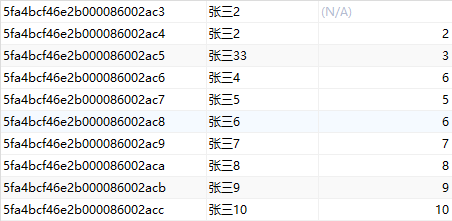

# MongoDB数据库

[TOC]

## 1.1 查询数据库

```sql
show databases
```

## 1.2 新增数据库

```sql
use 数据库名
```

若不存在，也会成功切换。

在创建数据时，自动创建数据库

## 1.3 删除数据库

```sql
use 数据库名; //先选择数据
db.dropDatabase();//再删除选择的数据库
```

# 2 集合

## 2.1 查询集合

```sql
show collections;
```

## 2.2 新增集合

```
db.createCollection("集合名");
```

## 2.3 删除集合

```sql
db.集合名.drop();
```

# 3 文档的增删改查

## 3.1 新增

```sql
db.集合名.insert(json数据)
```

集合存在，则直接插入数据，集合不存在则隐式创建

### 练习1：在test1数据库中的集合c1中插入数据。姓名：张三，年龄：26

```db
use test1;
db.c1.insert({姓名:"张三",年龄:26});
```


==每次插入数据，mongodb都会自动生成一个全球唯一的_id,此id可被覆盖==

**一次插入多条数据：使用js语法**

### 练习2：在test1数据库中的集合c2中插入10条数据。姓名：a1~a10，年龄：1~10

```sql
use test1;
for(let i=1;i<=10;i++){
	db.c2.insert({姓名:'a'+i,年龄:i})
}
```


## 3.2 查询

```sql
db.集合名.find({查询的条件},{查询的列})
```

- 条件：

  - 查询所有数据		{}或不写
  - 查询所有年龄为6的数据		{年龄:6}
  - 查询姓名为a3，年龄为3的数据		{年龄:3,姓名:a3}

- 查询的列 *可选*

  - 查询所有数据		不写
  - 查询age列		{age:1}
  - 查询除age外所有列		{age:0}

  **每次查询结果都会带上系统创建的_id**

### 条件查询

  条件查询需要带上转义字符

| 运算符 | 作用   |
| ------ | ------ |
| `$gt`  | `>`    |
| `$gte` | `>=`   |
| `$lt`  | `<`    |
| `$lte` | `<=`   |
| `$ne`  | `!=`   |
| `$in`  | in     |
| `$nin` | not in |
| `$or`  | or     |

  **使用方法：`{键,{运算符:值}}`**

### 练习1：查询所有数据

```sql
db.c2.find()
```


### 练习2：查询年龄列

```sql
db.c2.find({},{年龄:1})
```


### 练习3：查询除年龄列之外其他列的数据

```sql
db.c2.find({},{年龄:0})
```


### 练习4：查询所有年龄大于5岁的数据

```sql
db.c2.find({年龄:{$gt:5}})
```


### 练习5：查询所有年龄是5岁，7岁，8岁的数据

```sql
db.c2.find({年龄:{$in:[5,7,8]}})
```


### 练习6：查询所有年龄是5岁，7岁，8岁的人的姓名

```sql
db.c2.find({年龄:{$in:[5,7,8]}},{姓名:1})
```


## 3.3 修改

```sql
db.集合名.update({条件},{新数据},{upsert: [true/false],multi: [true/false]})  //分别对应修改时目标不存在是否插入数据和是否修改多条数据
```

### 修改器

| 修改器    | 作用     |
| --------- | -------- |
| `$inc`    | 递增     |
| `$rename` | 重命名列 |
| `$set`    | 修改列值 |
| `$unset`  | 删除列   |

**使用方法：`{修改器:{键:值}}`**

### 练习1：将{姓名:"张三1"}的数据改为{姓名:"张三2"}

```sql
db.c3.update({姓名:"张三1"},{姓名:"张三2"})
```


**未使用修改器，则会替换数据而非更新数据。**

#### 使用修改器修改{姓名:"张三3"}的数据为{姓名:"张三33"}

```sql
db.c3.update({姓名:"张三3"},{$set:{姓名:"张三33"}})
```


### 练习2：将{姓名:"张三4"}的年龄+2，将{姓名:"张三5"}的年龄-1

```sql
db.c3.update({姓名:"张三4"},{$inc:{年龄:2}})
```



```sql
db.c3.update({姓名:"张三5"},{$inc:{年龄:-1}})
```


### 练习3：修改器综合练习

先插入一条数据

```sql
db.c3.insert({姓名:"龙王",年龄:996,谁:"男",职位:"龙王"})
```

需求:

1. 姓名改成圣主
2. 年龄+1024
3. 谁字段改成性别
4. 删除职位字段

```sql
db.c3.update({姓名:"龙王"},{$set:{姓名:"圣主"},$inc:{年龄:1024},$rename:{谁:"性别"},$unset:{职位:1}})
```


### 练习4：修改{姓名:"张三1"}的年龄为20

```sql
db.c3.update({姓名:"张三1"},{$set:{年龄:20}})
```


未找到叫张三1的

**若未找到则新增。**

```sql
db.c3.update({姓名:"张三1"},{$set:{年龄:20}},{upsert:true})
```


### 练习5：修改{姓名:"张三2"}的年龄为20

```sql
db.c3.update({姓名:"张三2"},{$set:{年龄:20}})
```


只修改了一条。

**修改多条**

```sql
db.c3.update({姓名:"张三2"},{$set:{年龄:20}},{multi:true})
```


**新增多条也可以用`updateMany()`关键字**

## 3.4 删除

```sql
db.集合名.remove(条件,{justOne:[true/false]})  //是否只删除一条
```

默认删除多条

## 3.5 美化查询结果

```sql
db.集合名.find().pretty();
```
