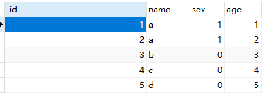
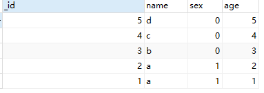

# MongoDB高级操作

[TOC]

## 1 排序

### 准备数据

```sql
use test2;
db.c1.insert({_id:1,name:"a",sex:1,age:1})
db.c1.insert({_id:2,name:"a",sex:1,age:2})
db.c1.insert({_id:3,name:"b",sex:0,age:3})
db.c1.insert({_id:4,name:"c",sex:0,age:4})
db.c1.insert({_id:5,name:"d",sex:0,age:5})

db.c1.find()
```



```sql
db.集合.find().sort({K:V})
```

| V取值 | 含义 |
| ----- | ---- |
| 1     | 升序 |
| -1    | 降序 |

### 练习：将数据按年龄降序排序

```sql
db.c1.find().sort({age:-1})
```



## 2 分页

limit 限制返回的条数

skip 限制起始位置

### 练习：每页2条，查第二页

```sql
db.c1.find().sort({age:-1}).skip(2).limit(2)
```

