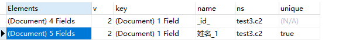
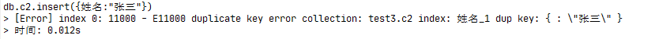

# MongoDB高级操作

[TOC]

## 1 排序

```sql
db.集合名.find().sort({需要排序的字段:[1/-1]}) //1升序 -1降序
```

### 准备数据

```sql
use test2;
db.c1.insert({_id:1,name:"a",sex:1,age:1})
db.c1.insert({_id:2,name:"a",sex:1,age:2})
db.c1.insert({_id:3,name:"b",sex:0,age:3})
db.c1.insert({_id:4,name:"c",sex:0,age:4})
db.c1.insert({_id:5,name:"d",sex:0,age:5})

db.c1.find()
```


### 练习：将数据按年龄降序排序

```sql
db.c1.find().sort({age:-1})
```


## 2 分页

```sql
db.集合名.find().limit(返回的条数).skip(跳过的条数)
```

### 练习：每页2条，查第二页

```sql
db.c1.find().sort({age:-1}).skip(2).limit(2)
```


```
skip = (起始页-1)*每页条数
limit = 每页条数
```

## 3 统计总条数

```sql
db.c1.find().count([0/1/false/true]) //false、0、不写都表示统计全部数据;true、非0数表示统计限制后的数据
```

**获取限制后的数据**

```sql
db.c1.find().skip(2).count(true)
```

## 4 聚合查询

db.collection.aggregate()是基于数据处理的聚合管道，每个文档通过一个由多个阶段（stage）组成的管道，可以对每个阶段的管道进行分组、过滤等功能，然后经过一系列的处理，输出相应的结果。

大概流程如下：


```sql
db.集合名.aggregate([
    {
    	管道:{
    		_id:需要参照的列,
    		查询结果:{表达式:需要处理的列}
    	}
    }
])
```

### 常用管道：

| 管道 | 说明 |
| ---- | ---- |
|$group | 将集合中的文档分组，用于统计结果|
|$match | 过滤数据，只输出符合条件的文档 |
|$sort |  聚合数据进一步排序|
|$skip | 跳过指定文档数|
|$limit | 限制集合数据返回文档数|

### 常用表达式：

| 表达式 | 说明 |
| ------ | ---- |
|$sum | 总和  *$sum:1同count表示统计* |
|$avg | 平均值 |
|$min | 最小值|
|$max | 最大值|

### 准备数据

```sql
use test3;
db.c1.insert({_id:1,name:"a",sex:1,age:1});
db.c1.insert({_id:2,name:"a",sex:1,age:2});
db.c1.insert({_id:3,name:"b",sex:2,age:3});
db.c1.insert({_id:4,name:"c",sex:2,age:4});
db.c1.insert({_id:5,name:"d",sex:2,age:5});
```

### 练习1：统计男生、女生的总年龄

```sql
db.c1.aggregate([
    {
        $group: {
            _id: "$sex",
            总数: {
                $sum: "$age"
            }
        }
    }
])
```


此时_id中的值对应c1中sex列的值。

### 练习2：统计男女生的总人数

```sql
db.c1.aggregate([
    {
        $group: {
            _id: "$sex",
            总数: {
                $sum: 1
            }
        }
    }
])
```


### 练习3：求学生总数和平均年龄

```sql
db.c1.aggregate([
    {
        $group: {
            _id: null,
            学生总数: {
                $sum: 1
            },
            平均年龄: {
                $avg: "$age"
            }
        }
    }
])
```


### 练习4：查询男生、女生人数，按人数升序

```sql
db.c1.aggregate([
    {
        $group: {
            _id: "$sex",
            人数: {
                $sum: 1
            }
        }
    },
    {
        $sort: {
            人数: -1
        }
    }
])
```


## 5 优化索引

```sql
db.集合名.createIndex({索引的列:[1/-1]})  //创建索引：1表示升序,-1表示降序
```

```sql
db.集合名.dropIndexes() //删除所有索引
```

```sql
db.集合名.dropIndex(索引名) //删除对应的索引
```

```sql
db.集合名.getIndexes() //查询所有索引
```


### 准备数据

```sql
for(let i=1;i<=10000;i++){
	db.c2.insert({姓名:"李四"+i,年龄:i,性别:i%2})
}
```

### 普通索引

#### 练习1：给姓名添加

```sql
db.c2.createIndex({姓名:-1})
```


第一个是_id的主键索引

第二个是我们创建的姓名索引

#### 练习2：删除姓名索引

```sql
db.c2.dropIndex("姓名_-1")
```


此时只剩主键索引

#### 练习3：给姓名创建索引并起名姓名索引

```sql
db.c2.createIndex({姓名:1},{name:"姓名索引"})
```


### 唯一索引

```sql
db.集合名.createIndex({索引的列:[1/-1]},{unique:列名})
```

#### 练习1：对姓名设置唯一索引

```sql
db.c2.createIndex({姓名:1},{unique:"姓名"})
```



#### 练习2：插入两次{姓名:"张三"}

```sql
db.c2.insert({姓名:"张三"})
```



第二次失败，因为姓名为张三的数据已经存在

## MongoDB权限机制

我们在本地使用MongoDB的时候，可以免输入账号和密码进行直接登录。在实际开发中，MongoDB有可能是在其他服务器，此时开启MongoDB的远程访问权限后，我们需要对MongoDB设置访问权限，防止数据泄露。

### 创建用户

```sql
db.createUser({
 user : 账号,
 pwd: 密码,
 roles : [{
   role: 角色,
   db: 所属数据库
 }]
})
```

#### 角色

<table style="text-align:center">
    <tr>
        <th>角色种类</th>
    	<th>角色名</th>
    	<th>角色说明</th>
    </tr>
	<tr>
        <td>超级用户角色</td>
        <td>root</td>
        <td>只在admin数据库中可用。超级账号，超级权限</td>
	</tr>
    <tr>
        <td rowspan=2>数据库用户角色</td>
        <td>read</td>
        <td>允许用户读取指定数据库</td>
	</tr>
    <tr>
        <td>readWrite</td>
        <td>允许用户读写指定数据库</td>
	</tr>
    <tr>
        <td rowspan=2>数据库管理角色</td>
        <td>dbAdmin</td>
        <td>允许用户在指定数据库中执行管理函数，如索引创建、删除，查看统计或访问system.profile</td>
	</tr>
    <tr>
        <td>userAdmin</td>
        <td>允许用户向system.users集合写入数据，可以在指定数据库里创建、删除和管理用户</td>
	</tr>
	<tr>
        <td rowspan=4>集群管理角色</td>
        <td>clusterAdmin</td>
        <td>只在admin数据库中可用，赋予用户所有分片和复制集相关函数的管理权限</td>
	</tr>
    <tr>
        <td>clusterManager</td>
        <td></td>
	</tr>
	<tr>
        <td>clusterMonitor</td>
        <td></td>
	</tr>
	<tr>
        <td>hostManagerr</td>
        <td></td>
	</tr>
    <tr>
        <td rowspan=2>备份恢复角色</td>
        <td>backup</td>
        <td></td>
	</tr>
    <tr>
        <td>restore</td>
        <td></td>
	</tr>
	<tr>
        <td rowspan=4>其他数据库角色</td>
        <td>readAnyDatabase</td>
        <td>只在admin数据库中可用，赋予用户所有数据库的读权限</td>
	</tr>
    <tr>
        <td>readWriteAnyDatabase</td>
        <td>只在admin数据库中可用，赋予用户所有数据库的读写权限</td>
	</tr>
	<tr>
        <td>userAdminAnyDatabase</td>
        <td>只在admin数据库中可用，赋予用户所有数据库的userAdmin权限</td>
	</tr>
	<tr>
        <td>dbAdminAnyDatabase</td>
        <td>只在admin数据库中可用，赋予用户所有数据库的dbAdmin权限</td>
	</tr>
</table>
