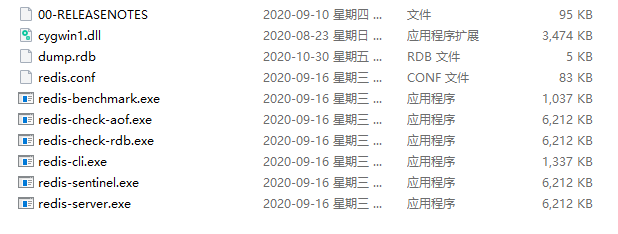
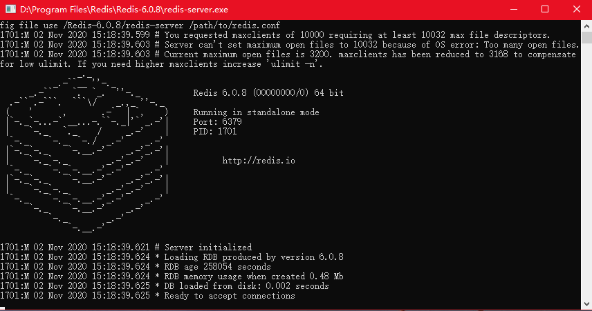
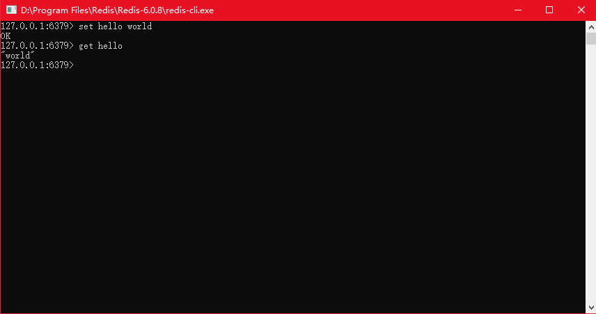
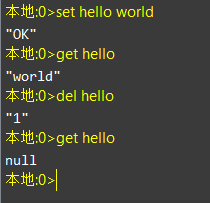
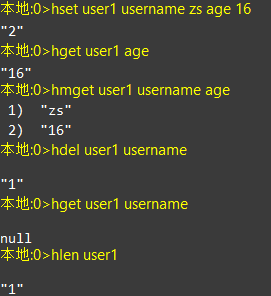
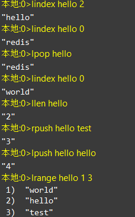
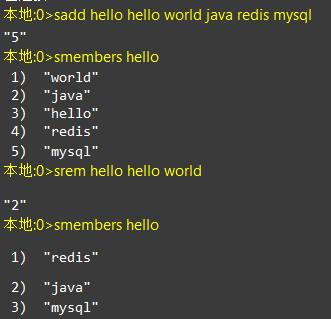
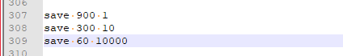
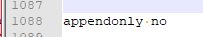

# Redis

[TOC]

## 1. Redis概述

###  1.1 什么是Redis

   Redis是用C语言开发的一个开源的高性能**键值对（key-value）数据库**，**数据是保存在内存里面的**. 官方提供测试数据，50个应用并发执行100000个请求,读的速度是110000次/s,写的速度是81000次/s ，且Redis通过提供多种键值数据类型来适应不同场景下的存储需求。

### 1.2 Redis基本数据类型

- 字符串类型 `String`
- 散列类型 `Hash`
- 列表类型 `List`
- 集合类型 `Set`
- 有序集合类型 `zset`

### 1.3 Redis的应用场景

- **缓存（数据查询、短连接、新闻内容、商品内容等等）**
- **任务队列。（秒杀、抢购、12306等等）**
- **数据过期处理（可以精确到毫秒, 短信验证码)** 
- 分布式集群架构中的session分离  session 服务器里面
- 聊天室的在线好友列表 
- 应用排行榜
- 网站访问统计

## 2 安装windows版客户端

### 2.1 下载

- 官网下载地址：<http://redis.io/download>
- github下载地址：https://github.com/MSOpenTech/redis/tags

### 2.2 文件目录结构

| 目录或文件           | 作用              |
| ------------------ | ------------------|
| redis-benchmark    | 性能测试工具        |
| redis-check-aof    | AOF文件修复工具     |
| redis-cli          | 命令行客户端        |
| redis-server       | redis服务器启动命令 |
| redis.windows.conf | redis核心配置文件   |

### 2.3 启动redis

双击`redis-server.exe`启动服务端

关闭窗口即关闭Redis服务端

双击`redis-client.exe`启动服务端

如图即可使用Redis客户端。关闭窗口即关闭Redis客户端。

### 2.4 可视化工具

Redis-desktop-manager

## 3 Redis 中的基本数据类型的操作

### 3.1 String 类型

| 命令          | 描述              |
| ------------- | :---------------- |
| set key value | 设置指定 key 的值 |
| get key       | 获取指定 key 的值 |
| del key       | 删除key           |

### 3.2 Hash 类型

Hash是一个**键值对集合**，常用于存储对象

| key   | value |
| ----- | -------------------------------- |
| user1 | name 张三 age 18 sex 男 |
| user2 | name 李四 age 18 sex 女 |

| 命令                                        | 描述                                                  |
| :------------------------------------------ | ----------------------------------------------------- |
| hset key filed value                        | 将哈希表 key 中的字段 field 的值设为 value            |
| hmset key field1 value1 [field2  value2]... | 同时将多个 field-value (字段-值)对设置到哈希表 key 中 |
| hget key filed                              | 获取存储在哈希表中指定字段的值                        |
| hmget key filed1 filed2                     | 获取多个给定字段的值                                  |
| hdel key filed1 [filed2]                    | 删除一个或多个哈希表字段                              |
| hlen key                                    | 获取哈希表中字段的数量                                |
| del key                                     | 删除整个hash(对象)                                    |

### 3.3 List 类型

| 命令                            | 命令描述                                |
| ------------------------------- | --------------------------------------- |
| lpush key value1 value2...      | 将一个或多个值插入到列表头部(左边 left) |
| rpush key value1 value2...      | 在列表中添加一个或多个值(右边 right)    |
|   lindex key index |获取列表中第index个值|
| lpop key                        | 左边弹出一个 相当于移除第一个           |
| rpop key                        | 右边弹出一个  相当于移除最后一个        |
| llen key                        | 返回指定key所对应的list中元素个数       |
| lrange key startIndex stopIndex | 查看列表中指定索引的元素                |

### 3.4 Set 类型

| 命令                        | 命令描述                      |
| --------------------------- | ----------------------------- |
| sadd key member1 member2... | 向集合添加一个或多个成员      |
| srem key member1 member2... | 移除一个成员或者多个成员      |
| smembers key                | 返回集合中的所有成员,查看所有 |

## 4 Redis通用操作

### 4.1 通用操作

- keys *: 查询所有的key

- exists key:判断是否有指定的key 若有返回1,否则返回0

- expire key 秒数:设置这个key在缓存中的存活时间  

- ttl key:展示指定key的剩余时间

  ​	若返回值为 -1:永不过期

  ​	若返回值为 -2:已过期或者不存在

- del key:删除指定key

- rename key 新key:重命名

- type key:判断一个key的类型

- ping :测试连接是否连接

### 4.2 Redis的数据库

Redis默认有16个数据库，默认在0号库

常用操作如下：

- select index:切换库
- move key index: 把key移动到几号库(index是库的编号)
- flushdb: 清空当前数据库
- flushall: 清空当前实例下所有的数据库

## 5 Redis的持久化

Redis的高性能是由于其将所有数据都存储在了内存中，为了使Redis在重启之后仍能保证数据不丢失，需要将数据从内存中同步到硬盘中，这一过程就是持久化。Redis支持两种方式的持久化，一种是RDB方式，一种是AOF方式。可以单独使用其中一种或将二者结合使用。

### 5.1 RDB 持久化机制

RDB持久化是指在**指定的时间间隔内**将内存中的数据集 快照 写入磁盘。这种方式是就是将内存中数据以快照的方式写入到二进制文件中,默认的文件名为dump.rdb。 **这种方式是默认已经开启了,不需要手动开启.**

RDB持久化机制的配置

在redis.windows.conf配置文件中有如下配置：

其中，上面配置的是RDB方式数据持久化时机：

| 关键字 | 时间(秒) | key修改数量 | 解释                                                  |
| ------ | -------- | ----------- | ----------------------------------------------------- |
| save   | 900      | 1           | 每900秒(15分钟)至少有1个key发生变化，则dump内存快照   |
| save   | 300      | 10          | 每300秒(5分钟)至少有10个key发生变化，则dump内存快照   |
| save   | 60       | 10000       | 每60秒(1分钟)至少有10000个key发生变化，则dump内存快照 |

### 5.2 AOF持久化机制

 AOF持久化机制会将**每一个收到的写命令**都通过write函数追加到文件中,默认的文件名是appendonly.aof。 这种方式默认是没有开启的,要使用时候需要配置.

默认配置为：

将appendonly修改为yes， 但是启动redis的时候需要指定该文件,也就是意味着不能直接点击了, 需要输入命令启动: `redis-server.exe redis.windows.conf`

以上为aof持久化时机。

| 关键字      | 持久化时机 | 解释                           |
| ----------- | ---------- | ------------------------------ |
| appendfsync | always     | 每执行一次更新命令，持久化一次 |
| appendfsync | everysec   | 每秒钟持久化一次               |
| appendfsync | no         | 不持久化                       |